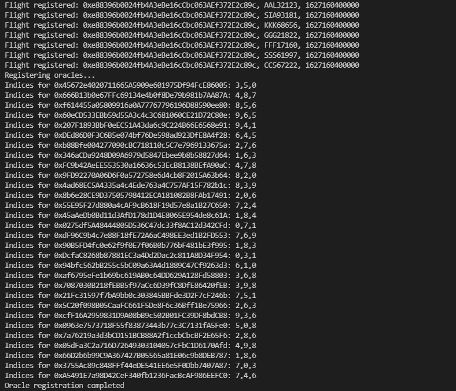
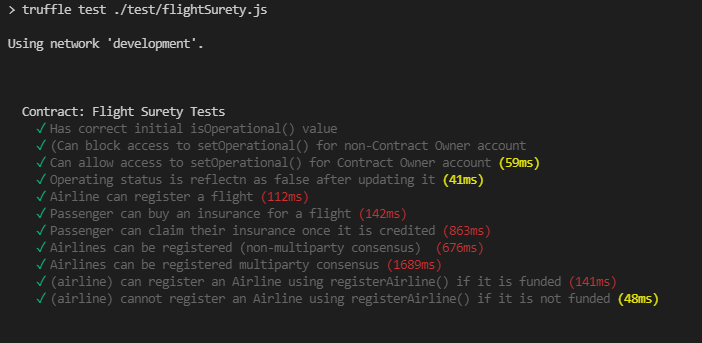

# FlightSurety

FlightSurety is a sample application project for Udacity's Blockchain course.

## Project Prerequisites

Please ensure that you have the follow installed on your machine:

* Node version >= 12
* Ganache

## Setup/Run
* To install, download or clone the repo, then: 
`npm install` 
`truffle compile`
* Run Ganache and make sure that there are at least 40 accounts.
* Specify the correct endpoint in `truffle-config.js` before deploying the contract: 
`truffle migrate --reset`
* Start the server and dapp client: 
`npm run server` 
`npm run dapp`
* The server will take about less than a minute to start up while registering oracles 
(refer to the image below to know that server is ready)

* Visit the Dapp client page at http://localhost:8080 to start using the app

## How to use the Dapp?
The Dapp client is configured to use the third index of accounts as the passenger.
This is the general flow of application usage:
* Retrieve flight info
* Purchase insurance if it is available (over here we assume that an insurance is not for sale once flight status is fetched to prevent gaming the system)

## Running Tests

To run truffle tests:

`truffle test ./test/flightSurety.js` 
`truffle test ./test/oracles.js`

The tests for contract are written to cover the main functionalities.
It also demonstrates:
* airline registration by other airlines (for first 4 airlines)
* multi-party consensus airline registration
* airline can only participate in contract after it funds 10 ether

## Resources

* [How does Ethereum work anyway?](https://medium.com/@preethikasireddy/how-does-ethereum-work-anyway-22d1df506369)
* [BIP39 Mnemonic Generator](https://iancoleman.io/bip39/)
* [Truffle Framework](http://truffleframework.com/)
* [Ganache Local Blockchain](http://truffleframework.com/ganache/)
* [Remix Solidity IDE](https://remix.ethereum.org/)
* [Solidity Language Reference](http://solidity.readthedocs.io/en/v0.4.24/)
* [Ethereum Blockchain Explorer](https://etherscan.io/)
* [Web3Js Reference](https://github.com/ethereum/wiki/wiki/JavaScript-API)